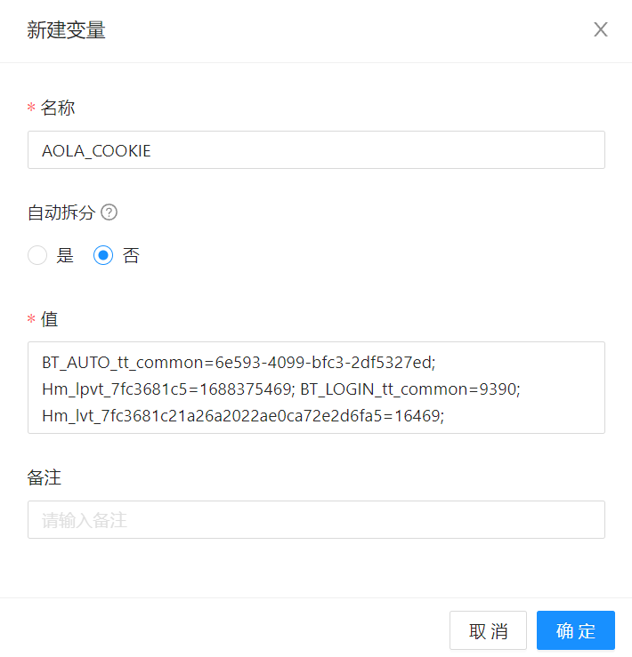
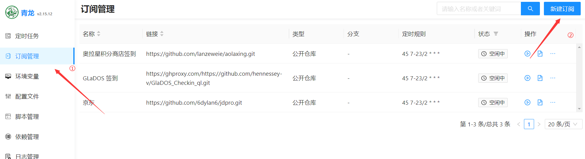
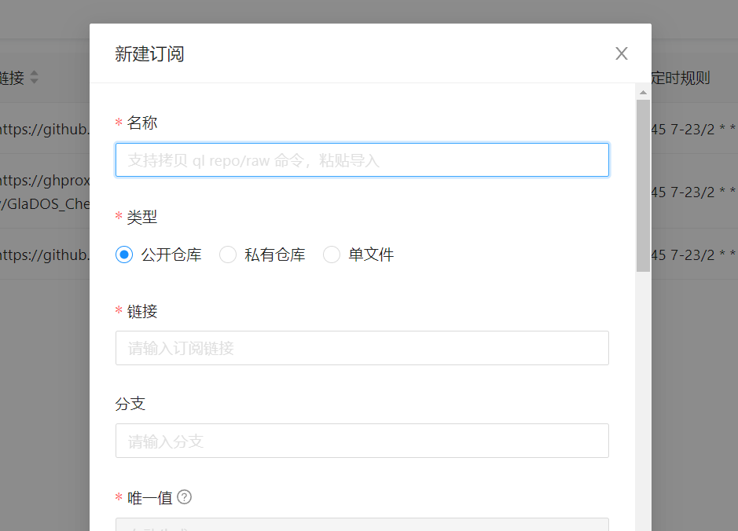
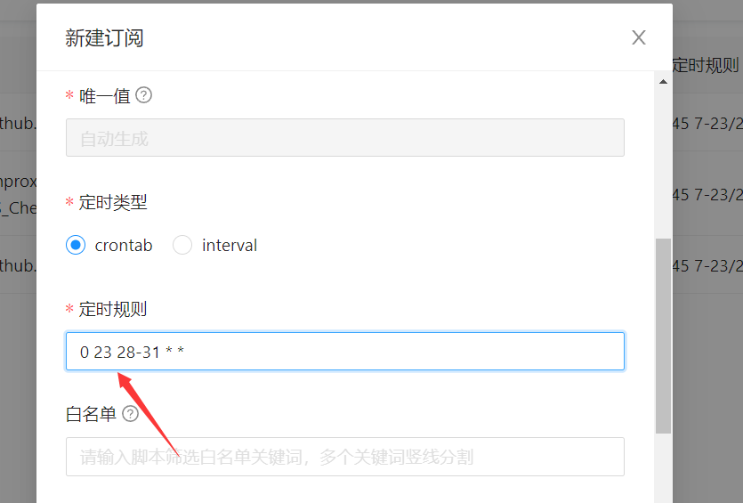
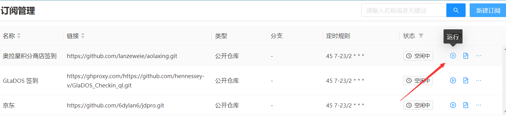
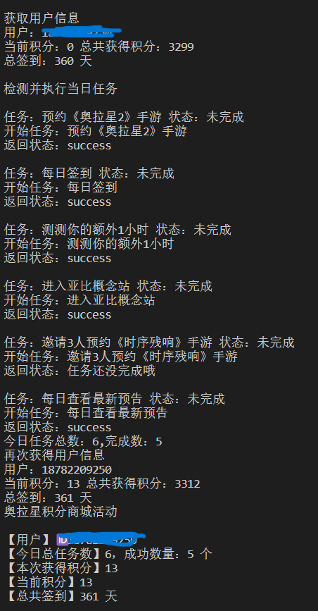

<div align="center">
<h1 align="center">奥拉星积分商城自动化脚本</h1>

使用 Python3 的自动化完成任务脚本

~~等待开发成青龙一键订阅定时任务~~<br>2023/7/3 添加青龙管理
</div>

## 介绍
任务网站：http://www.100bt.com/m/creditMall/?gameId=2#task
经过抓包测试，百田积分商城的每个任务结算是发出任务完成请求，就可以完成此任务获得积分。<br>
并且每个任务都使用了一样的模板，只需要找到请求完成任务网站，并且附加任务信息就可以一键完成任务。<br>
❗注意：无法完成邀请人的任务<br>
任务完成速度在10s内

## 功能
- 多用户
- 输出完成信息（用户信息、任务完成数、获得积分点、总共签到天数）
- 支持青龙面板订阅

## 目录结构
——————aola  
————aolastop.py  主程序  
————cookie.json  用户信息(支持多用户)  
————cookie.py    手动登录获得cookie  
————ua.txt       浏览器随机UA  

## 使用
在 cookie.json 中填写 用户cookie  
cookie 可以从cookie.py 手动登录获得  
需要把chromedriver.exe放入当前目录
Cookie格式例如<br>  
```BT_AUTO_tt_common=; Hm_lpvt_7fc3681c21a26a2022ae0ca72e2d6fa5=; BT_LOGIN_tt_common=:187****; Hm_lvt_7fc3681c21a26a2022ae0ca72e2d6fa5=;```  
程序活动：
``` python cookie.py ```  

将输出的信息填写到 cookie.json  
开始任务  

``` python aolastop.py ```

## 钉钉推送与青龙一键订阅
~~暂时没有时间完善有成功完善的伙伴请帮忙提交~~  
2023/7/3 增加青龙面板订阅 

### 订阅教程  
```青龙面板``` -> ```订阅管理``` -> ```新建订阅```, 在名称输入框粘贴命令并执行<br><br>
1.Github直链：```ql repo https://github.com/lanzeweie/aolaxing.git "QLaolastart.py|ua.txt" "PNG|README.md" "sendNotify.py"```<br>
2.国内代理github：```ql repo https://ghproxy.com/https://github.com/lanzeweie/aolaxing.git "QLaolastart.py|ua.txt" "PNG|README.md" "sendNotify.py"```<br>
订阅更新可以填写 一个月最后一天23点更新<br>
``` 0 23 28-31 * * ``` <br>
### 环境变量|用户COOKIE
青龙面板环境变量 
新建变量-AOLA_COOKIE-Cookie 


## 图教程 
  
  

  
  
## 截图

